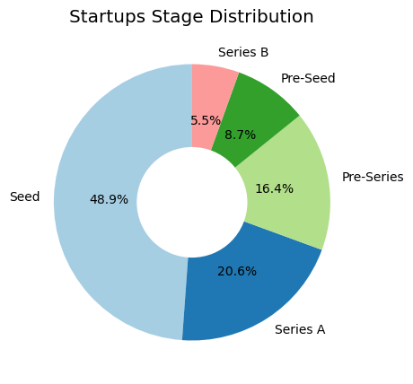
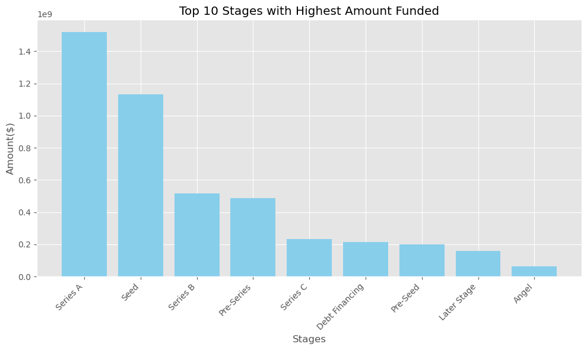
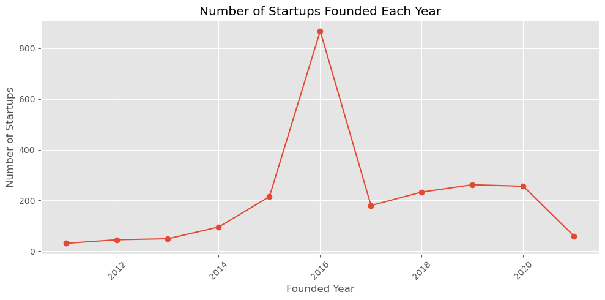
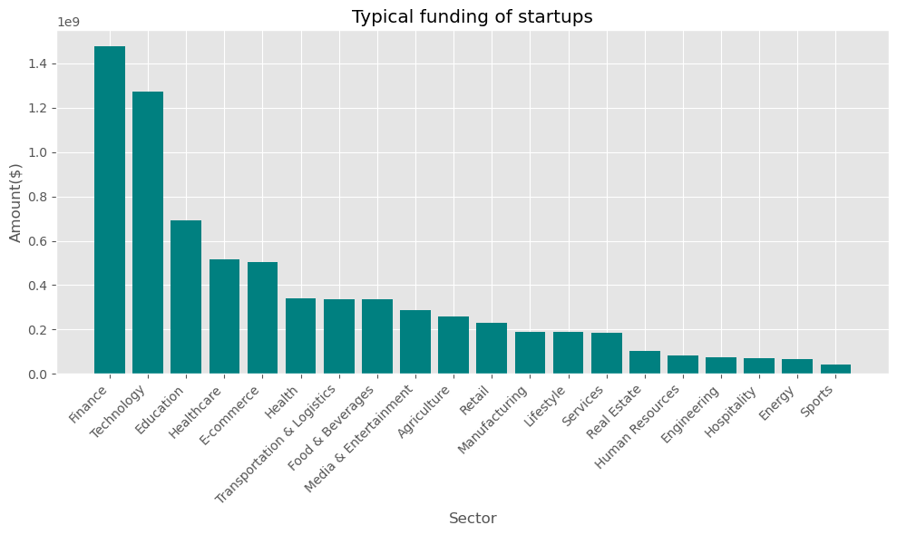

# Data Analysis Project -- Indian Start-up Funding Analysis

This project is based on funding received by startup in india between 2018 to 2021. The objective of this project is to provide insights to key stakeholders interested in venturing into the indian startup ecosystem. We will analyze key business metrics in funding received by startups in india. The insights gained will be used by startup management to make data driven decisions about investing in the indian market.
investors\' information.

## Formulated Questions to our analysis
1. To what extent do cities influence funding (amount,etc)?
2. Which industries are preffered by investors for funding?
3. At which stage do startups get more funding from investors?
4. What is the typical funding amount that startups receive in india?
5. Which type of investors invest the most money?

## Hypothesis
**Null:** The location of a startup doesn't affect the amount of funding received frominvestors.

**Alternate:** The location of a startup significantly affects the amount of funding issued by investors.

|**Company/Brand**|Name of the company/start-up|
|---|---|
|**Founded**: Year|start-up was founded|
|**Sector**|Sector of service|
|**What it does**|Description about Company|
|**Founders**|Founders of the Company|
|**Investor**|Investors|
|**Amount(\$)**|Raised fund|
|**Stage**|Round of funding reached|
|**Funding_Year**|Year startup was Funded by Investor|
|**Start-up_Age**|Age difference between Founded and Funding_Year|
|**HeadQuarter**|City/State start-up is located|

.
## Data Processing/cleaning
-   Data was accessed from different sources
-   Data was loaded and cleaned separately
-   Null values and missing values were imputed
-   Some categorical columns were recategorized
-   Feature engineering(New features were added)
-   Data was analyzed

##   Visualise the data

## Conclusion
-   Vizualization of the business questions has proven that the location of a business does significantly affect amount of investor funding. I reject the null hypothesis in favor of the alternate hypothesis.

## Author
-   Benjamin Kaitany

-   Data Analyst

-   Azubi Africa