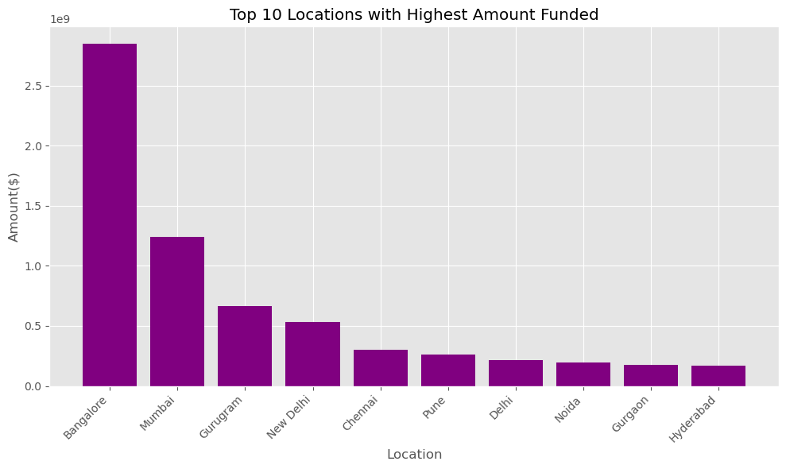
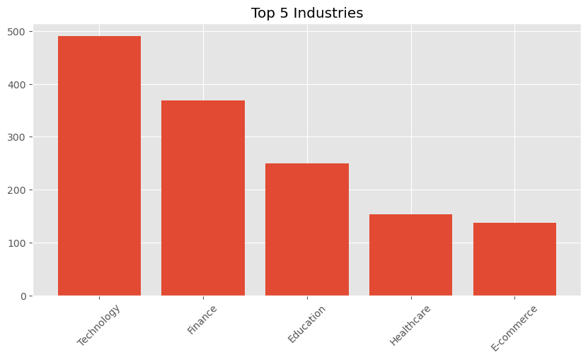
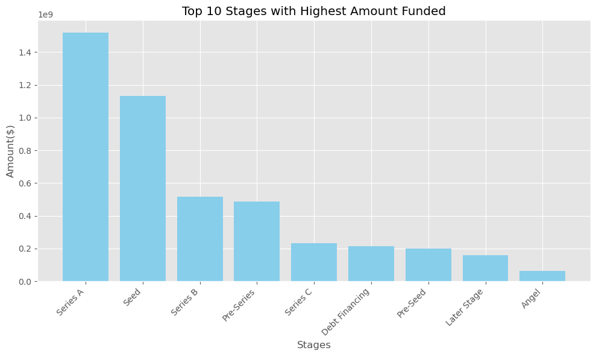
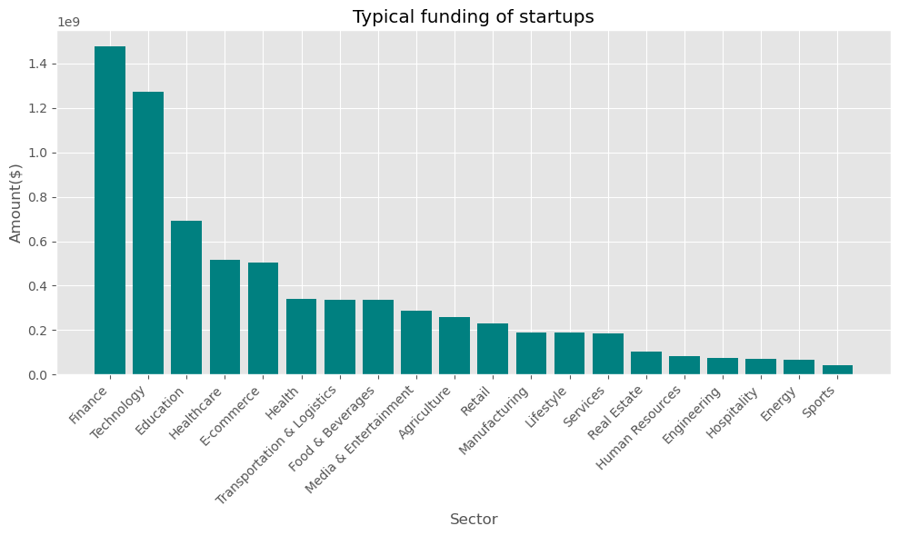
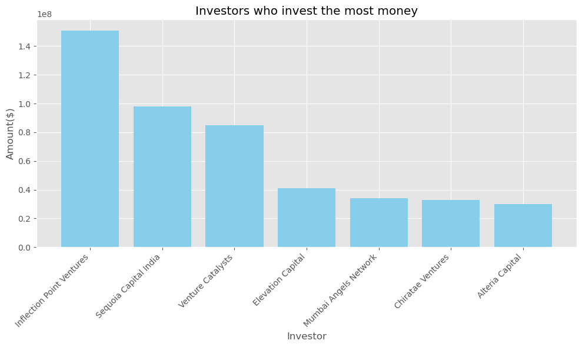

# Data Analysis Project: Indian Start-up Ecosystem

This project is based on funding received by startup in india between 2018 to 2021. The objective of this project is to provide insights to key stakeholders interested in venturing into the indian startup ecosystem. Entrepreneurs can leverage analytics to make informed decisions about investments, business risks and opportunities to explore. I will analyze key business metrics in funding received by startups in india. The insights gained will be used by startup management to make data driven decisions about investing in the indian market.

## 1. Hypothesis
**Null:** The location of a startup doesn't affect the amount of funding received from investors.

**Alternate:** The location of a startup significantly affects the amount of funding issued by investors.

-  *Attached are articles to my project with more information.*

 
|**Article**           |       Links          |                 Description               |
|:---------------------:|:-------------------:|:-------------------------------------------:|
|**:PowerBi**          |https://app.powerbi.com/links/3D9PWIZQMc?ctid=4487b52f-f118-4830-b49d-3c298cb71075&pbi_source=linkShare                     |Visual representation of my project in a Dashboard|
|**Medium**            |https://medium.com/@benjaminkipkem/analysis-of-indian-startup-ecosytem-based-on-funding-from-2018-2021-bae001d37a67                     |Published article with interactive visuals.                              |

## 2. Formulated Questions to my analysis
1. To what extent do cities influence funding (amount,etc)?
2. Which industries are preffered by investors for funding?
3. At which stage do startups get more funding from investors?
4. What is the typical funding amount that startups receive in india?
5. Which type of investors invest the most money?

## 3. Columns in my Dataset
|**Company/Brand**|Name of the company/start-up|
|---|---|
|**Founded**:|Year start-up was founded|
|**Sector**|Sector of service|
|**What it does**|Description about Company|
|**Founders**|Founders of the Company|
|**Investor**|Investors|
|**Amount(\$)**|Raised fund|
|**Stage**|Round of funding reached|
|**Funding_Year**|Year startup was Funded by Investor|
|**Start-up_Age**|Age difference between Founded and Funding_Year|
|**HeadQuarter**|City/State start-up location|

## 4. Data Processing steps:-
- **Data acquisition**: The 2020 and 2021 datasets were stored in a database and credentials were required to access them. The 2019 dataset was stored in Azubi OneDrive folder and the 2018 dataset was stored in Azubi github repository.
---
- **Data loading and cleaning**: Datasets were dirty and I cleaned them separately because they pertained to different years and economic timeframes. Some columns were missing particularly  in the 2018 dataset, some columns had missing values and and also duplicates.
---
- **Handling Null and missing values**: To derive insight and information from the datasets, I imputed null and missing values based on column characteristics and statistics.
---
- **Some categorical column values were recategorized**:  This is to avoid inconsistency of data and facilitate quality analysis. 
---
- **Feature engineering**: I created additional new colummns, namely 'Start-up Age' and 'Year_Funded' to assist in the analysis process and insight generation.
---
- **Data was analyzed**:  I combined all the datasets after the cleaning process and used various pandas methods to perform data exploration, analysis and visualizations. Ultimately, I was able to evaluate the dataset and discovered viable information about the startup ecosystem.
---

## 5 Visualizations**

*Below are my vizualizations that answer outlined business questions:-*

**1st Insight**: Location influences amount of investor funding issued. Bangalore city had the most funded startups.

**2nd Insight**: Technology, Finance, Education, Healthcare and E-commerce are the most preferred sectors by investors

**3rd Insight**: Seed followed closely by Series A are the stages that received most funding.

**4th Insight**: Finance and Technology are the most funded sectors by investors whereas Sports and Energy are the least funded.

**5th Insight**: Inflection Point Ventures invested most funds in the startups. 

## 6 Conclusion
-   Analysis and vizualization proved that the location of a business does significantly affect the amount of investor funding, and I rejected the null hypothesis in favor of the alternate hypothesis.

## 7. Appreciation
-   I highly recommend Azubi Africa for their comprehensive and effective programs. Read More articles about https://medium.com/@azubiafrica and take a few minutes to visit this link to learn more about Azubi Africa life-changing https://bit.ly/41CGCwK 

-  **Tags**

https://bit.ly/3ARq742

## Author
-   Benjamin Kaitany

-   Data Analyst

-   Azubi Africa